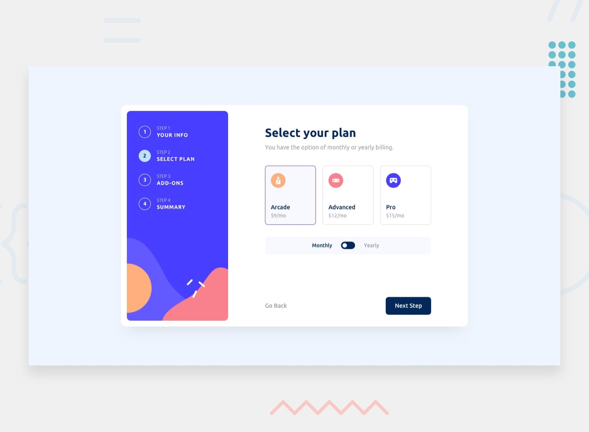

# Multi-step form

This is a solution to the [Multi-step form challenge on Frontend Mentor](https://www.frontendmentor.io/challenges/multistep-form-YVAnSdqQBJ).

## Table of contents

- [Overview](#overview)
  - [The challenge](#the-challenge)
  - [Screenshot](#screenshot)
  - [Links](#links)
- [My process](#my-process)
  - [Built with](#built-with)
  - [What I learned](#what-i-learned)
- [Author](#author)

## Overview

### The challenge

Create a simple multiple-step form where users should be able to:

- Complete each step of the sequence
- See a summary of their selections on the final step and confirm their order
- View the optimal layout for the interface depending on their device's screen size
- See hover and focus states for all interactive elements on the page
- See front-end validation on inputs to proceed to subsequent steps

### Screenshot

### Links

- Live Site URL: [Multi-Step Form](https://multi-step-form-template.netlify.app/)

## My process

### Built with

- Semantic HTML5 markup
- CSS3
- [React](https://reactjs.org/)
- [React-Router](https://reactrouter.com/)
- [Redux-Toolkit](https://redux-toolkit.js.org/)

### What I learned

I have used Redux previously, however this was the first project I used Redux-toolkit. Whilst I found it challenging at the start. After I got my head around how much manual coding has been streamlined I loved it. A massive improvement on manual Redux, and I plan to use Redux-toolkit in future projects.

## Author

- Website - [Prish.al](https://prish.al)
- GitHub - [@PrishalM](https://github.com/prishalM/)
- Frontend Mentor - [@PrishalM](https://www.frontendmentor.io/profile/PrishalM)
- Instagram - [@prish.al](https://www.twitter.com/prish.al)
